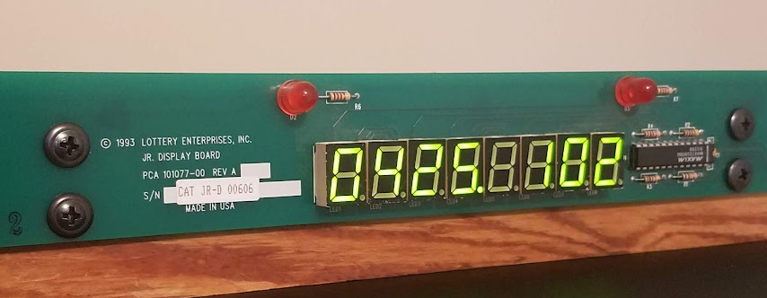

# lotterydisplay

Broadcasts time and temp for display on an 8 digit 7 segment surplus lottery display. Probably needed upgrading with
jackpots regularly exceeding $100M.

The display came from [Gateway Electronics](https://www.gatewayelectronics.com/) which has been closed recently,
hopefully they will return.

created by [tigwen](https://github.com/mlctrez/tigwen)
